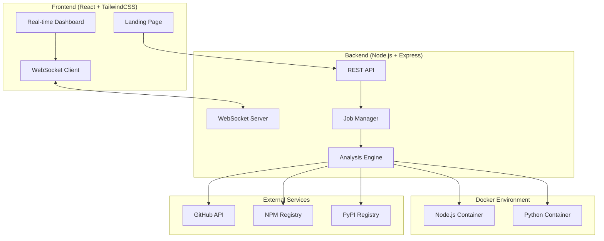

# Design Document

## Overview

The AI-Powered Supply Chain Threat Detection system is architected as a modern full-stack application with real-time capabilities. The system uses a microservices approach with a Node.js backend handling API requests and Docker orchestration, a React frontend providing real-time dashboards, and Docker containers for secure sandboxed analysis.

The architecture prioritizes security through containerization, scalability through concurrent job processing, and user experience through real-time WebSocket communication.

## Architecture

### High-Level Architecture



### Technology Stack

**Backend:**
- Node.js with Express.js for REST API
- Socket.IO for real-time WebSocket communication
- Dockerode for Docker container management
- UUID for job ID generation
- Child process for Git operations

**Frontend:**
- React.js with functional components and hooks
- TailwindCSS for styling with shadcn/ui components
- Socket.IO client for real-time updates
- Recharts for data visualization
- Vite for build tooling

**Infrastructure:**
- Docker for sandboxed execution environments
- Custom Docker images for Node.js and Python analysis
- In-memory job storage (extensible to Redis/MongoDB)

## Components and Interfaces

### Backend Components

#### 1. REST API Layer (`/routes`)

**Endpoints:**
```javascript
POST /api/analyze-repo
{
  "repoUrl": "https://github.com/user/repo",
  "projectType": "nodejs" | "python"
}
Response: { "jobId": "uuid", "status": "pending" }

GET /api/job/:jobId/status
Response: { 
  "jobId": "uuid",
  "status": "pending" | "running" | "completed" | "failed",
  "progress": 0-100,
  "startTime": "ISO timestamp",
  "endTime": "ISO timestamp" | null
}
```

#### 2. WebSocket Server (`/services/websocket.js`)

**Events:**
```javascript
// Client subscribes to job updates
socket.join(`job-${jobId}`)

// Server emits to job room
io.to(`job-${jobId}`).emit('log', { 
  timestamp: Date.now(),
  level: 'info' | 'warn' | 'error',
  message: string,
  source: 'build' | 'analysis' | 'system'
})

io.to(`job-${jobId}`).emit('alert', {
  id: 'uuid',
  severity: 'low' | 'medium' | 'high',
  type: 'dependency' | 'commit' | 'runtime',
  title: string,
  description: string,
  details: object
})

io.to(`job-${jobId}`).emit('progress', {
  percentage: 0-100,
  stage: 'cloning' | 'building' | 'analyzing' | 'complete'
})

io.to(`job-${jobId}`).emit('done', {
  riskScore: 0-100,
  riskLevel: 'low' | 'medium' | 'high',
  summary: {
    totalAlerts: number,
    criticalAlerts: number,
    dependencyIssues: number,
    commitIssues: number
  },
  alerts: Alert[]
})
```

#### 3. Job Manager (`/services/jobManager.js`)

```javascript
class JobManager {
  constructor() {
    this.jobs = new Map() // In-memory storage
    this.activeJobs = new Set()
  }
  
  createJob(repoUrl, projectType) {
    const jobId = uuid()
    const job = {
      id: jobId,
      repoUrl,
      projectType,
      status: 'pending',
      progress: 0,
      startTime: new Date(),
      endTime: null,
      alerts: [],
      logs: []
    }
    this.jobs.set(jobId, job)
    return jobId
  }
  
  async executeJob(jobId) {
    // Orchestrates the analysis pipeline
  }
}
```

#### 4. Analysis Engine (`/services/analysisEngine.js`)

```javascript
class AnalysisEngine {
  async analyzeRepository(job) {
    // 1. Clone repository
    await this.cloneRepo(job)
    
    // 2. Launch appropriate Docker container
    const container = await this.createContainer(job.projectType)
    
    // 3. Build project and capture logs
    await this.buildProject(container, job)
    
    // 4. Run security analysis
    await this.runSecurityAnalysis(container, job)
    
    // 5. Calculate risk score
    const riskScore = this.calculateRiskScore(job.alerts)
    
    // 6. Cleanup
    await this.cleanup(container)
    
    return { riskScore, alerts: job.alerts }
  }
  
  async runSecurityAnalysis(container, job) {
    await Promise.all([
      this.analyzeDependencies(container, job),
      this.analyzeCommits(job),
      this.analyzeRuntimeLogs(job)
    ])
  }
}
```

#### 5. Docker Service (`/services/dockerService.js`)

```javascript
class DockerService {
  constructor() {
    this.docker = new Docker()
  }
  
  async createAnalysisContainer(projectType, repoPath) {
    const image = projectType === 'nodejs' 
      ? 'threat-detector:node' 
      : 'threat-detector:python'
    
    return await this.docker.createContainer({
      Image: image,
      Cmd: ['/bin/bash'],
      WorkingDir: '/workspace',
      HostConfig: {
        Binds: [`${repoPath}:/workspace`],
        NetworkMode: 'none', // Isolated network
        Memory: 512 * 1024 * 1024, // 512MB limit
        CpuShares: 512
      }
    })
  }
}
```

### Frontend Components

#### 1. Landing Page (`/src/pages/LandingPage.jsx`)

```jsx
function LandingPage() {
  const [repoUrl, setRepoUrl] = useState('')
  const [projectType, setProjectType] = useState('nodejs')
  const [isSubmitting, setIsSubmitting] = useState(false)
  
  const handleSubmit = async (e) => {
    // Validate URL, submit to API, redirect to dashboard
  }
  
  return (
    <div className="min-h-screen bg-background">
      <Card className="max-w-md mx-auto">
        <form onSubmit={handleSubmit}>
          <Input 
            placeholder="https://github.com/user/repo"
            value={repoUrl}
            onChange={(e) => setRepoUrl(e.target.value)}
          />
          <Select value={projectType} onValueChange={setProjectType}>
            <SelectItem value="nodejs">Node.js</SelectItem>
            <SelectItem value="python">Python</SelectItem>
          </Select>
          <Button type="submit" disabled={isSubmitting}>
            Analyze Repository
          </Button>
        </form>
      </Card>
    </div>
  )
}
```

#### 2. Dashboard (`/src/pages/Dashboard.jsx`)

```jsx
function Dashboard({ jobId }) {
  const [job, setJob] = useState(null)
  const [logs, setLogs] = useState([])
  const [alerts, setAlerts] = useState([])
  const socket = useSocket()
  
  useEffect(() => {
    // Subscribe to job updates
    socket.emit('join', `job-${jobId}`)
    
    socket.on('log', (log) => setLogs(prev => [...prev, log]))
    socket.on('alert', (alert) => setAlerts(prev => [...prev, alert]))
    socket.on('progress', (progress) => setJob(prev => ({...prev, progress})))
    socket.on('done', (summary) => setJob(prev => ({...prev, summary, status: 'completed'})))
    
    return () => socket.disconnect()
  }, [jobId])
  
  return (
    <div className="min-h-screen bg-background">
      <Header job={job} />
      <Tabs defaultValue="logs">
        <TabsList>
          <TabsTrigger value="logs">Logs</TabsTrigger>
          <TabsTrigger value="commits">Commits</TabsTrigger>
          <TabsTrigger value="dependencies">Dependencies</TabsTrigger>
          <TabsTrigger value="summary">Summary</TabsTrigger>
        </TabsList>
        
        <TabsContent value="logs">
          <LogConsole logs={logs} />
        </TabsContent>
        
        <TabsContent value="commits">
          <CommitTimeline alerts={alerts.filter(a => a.type === 'commit')} />
        </TabsContent>
        
        <TabsContent value="dependencies">
          <DependencyTable alerts={alerts.filter(a => a.type === 'dependency')} />
        </TabsContent>
        
        <TabsContent value="summary">
          <SummaryCard job={job} alerts={alerts} />
        </TabsContent>
      </Tabs>
    </div>
  )
}
```

#### 3. Real-time Components

**LogConsole Component:**
```jsx
function LogConsole({ logs }) {
  const logEndRef = useRef(null)
  
  useEffect(() => {
    logEndRef.current?.scrollIntoView({ behavior: 'smooth' })
  }, [logs])
  
  return (
    <Card className="h-96 overflow-y-auto bg-black text-green-400 font-mono text-sm">
      {logs.map((log, index) => (
        <div key={index} className={`p-1 ${getLogLevelClass(log.level)}`}>
          <span className="text-gray-500">[{formatTime(log.timestamp)}]</span>
          <span className="ml-2">{log.message}</span>
        </div>
      ))}
      <div ref={logEndRef} />
    </Card>
  )
}
```

## Data Models

### Job Model
```javascript
{
  id: 'uuid',
  repoUrl: 'string',
  projectType: 'nodejs' | 'python',
  status: 'pending' | 'running' | 'completed' | 'failed',
  progress: 0-100,
  startTime: Date,
  endTime: Date | null,
  riskScore: 0-100 | null,
  riskLevel: 'low' | 'medium' | 'high' | null,
  alerts: Alert[],
  logs: Log[],
  summary: {
    totalAlerts: number,
    criticalAlerts: number,
    dependencyIssues: number,
    commitIssues: number,
    buildSuccess: boolean
  }
}
```

### Alert Model
```javascript
{
  id: 'uuid',
  jobId: 'uuid',
  timestamp: Date,
  severity: 'low' | 'medium' | 'high',
  type: 'dependency' | 'commit' | 'runtime',
  title: 'string',
  description: 'string',
  details: {
    // Type-specific details
    packageName?: 'string',
    commitHash?: 'string',
    filePath?: 'string',
    lineNumber?: number,
    suggestion?: 'string'
  }
}
```

### Log Model
```javascript
{
  timestamp: Date,
  level: 'info' | 'warn' | 'error',
  message: 'string',
  source: 'build' | 'analysis' | 'system'
}
```

## Error Handling

### Backend Error Handling

1. **Docker Container Failures:**
   - Timeout handling for long-running builds
   - Resource limit enforcement
   - Graceful container cleanup on failure
   - Fallback analysis with partial data

2. **Git Clone Failures:**
   - Invalid repository URL validation
   - Private repository access handling
   - Network timeout handling
   - Large repository size limits

3. **Analysis Engine Errors:**
   - Malformed package.json/requirements.txt handling
   - Missing dependency files graceful degradation
   - AI analysis service timeout handling

### Frontend Error Handling

1. **WebSocket Connection:**
   - Automatic reconnection on disconnect
   - Connection status indicators
   - Graceful degradation to polling

2. **API Failures:**
   - Network error retry logic
   - User-friendly error messages
   - Loading state management

## Testing Strategy

### Backend Testing

1. **Unit Tests:**
   - Job Manager operations
   - Analysis Engine components
   - Docker Service container management
   - WebSocket event handling

2. **Integration Tests:**
   - End-to-end job processing
   - Docker container lifecycle
   - Real repository analysis
   - WebSocket communication

3. **Security Tests:**
   - Container isolation verification
   - Malicious code containment
   - Resource limit enforcement

### Frontend Testing

1. **Component Tests:**
   - Landing page form validation
   - Dashboard tab navigation
   - Real-time log updates
   - Alert rendering

2. **Integration Tests:**
   - WebSocket connection handling
   - API integration
   - User workflow testing

3. **E2E Tests:**
   - Complete analysis workflow
   - Multi-tab functionality
   - Real-time updates

### Performance Testing

1. **Concurrent Job Handling:**
   - Multiple simultaneous analyses
   - Resource utilization monitoring
   - Memory leak detection

2. **Large Repository Handling:**
   - Build timeout scenarios
   - Memory usage optimization
   - Progress reporting accuracy