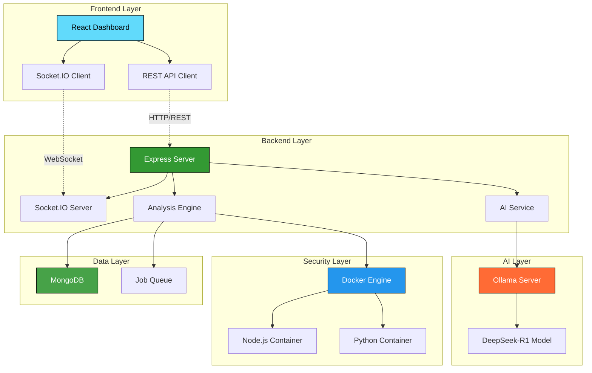
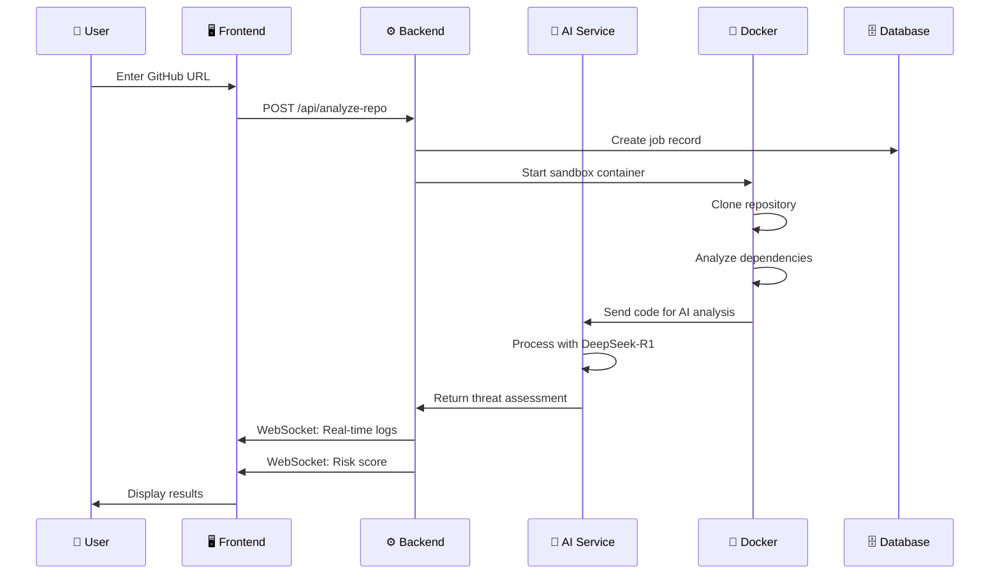

<div align="center">

# 🐕 CodeDog
### AI-Powered Supply Chain Threat Detection Platform


<br/>

[](https://nodejs.org/)
[](https://reactjs.org/)
[](https://docker.com/)
[](https://ollama.ai/)
[](https://mongodb.com/)
[](https://socket.io/)

---

*🚀 A cutting-edge full-stack application that analyzes GitHub repositories for security threats in real-time using local AI models and advanced threat detection algorithms*

</div>

## ✨ Features

<table>
<tr>
<td>

### 🧠 **AI-Powered Analysis**
- Local LLM integration with Ollama
- DeepSeek-R1 model for threat detection
- Intelligent commit analysis
- Automated vulnerability assessment

</td>
<td>

### ⚡ **Real-Time Monitoring**
- Live log streaming via WebSocket
- Instant threat alerts
- Progress tracking
- Dynamic dashboard updates

</td>
</tr>
<tr>
<td>

### 🛡️ **Advanced Security**
- Docker container sandboxing
- Network isolation
- Resource limitations
- Input sanitization

</td>
<td>

### 🎨 **Modern Interface**
- Beautiful dark mode UI
- Responsive design
- Interactive analytics
- Professional dashboards

</td>
</tr>
</table>

## 🏗️ System Architecture



## 🚀 Quick Start

<div align="center">

### 📋 Prerequisites

<table>
<tr>
<td align="center">

<br><strong>Node.js 18+</strong>
</td>
<td align="center">

<br><strong>Docker Desktop</strong>
</td>
<td align="center">

<br><strong>Git</strong>
</td>
<td align="center">

<br><strong>Ollama</strong>
</td>
</tr>
</table>

</div>

### 🛠️ Installation

<details>
<summary><b>🔧 Step-by-Step Setup Guide</b></summary>

#### 1️⃣ **Clone the Repository**
```bash
git clone https://github.com/Mihir-Rabari/code-dog.git
cd code-dog
```

#### 2️⃣ **Setup Ollama & AI Model**
```bash
# Install Ollama (if not already installed)
curl -fsSL https://ollama.ai/install.sh | sh

# Pull the DeepSeek-R1 model
ollama pull deepseek-r1:1.5b

# Verify installation
ollama list
```

#### 3️⃣ **Backend Setup**
```bash
cd backend
npm install

# Create environment file
cp .env.example .env
# Edit .env with your configurations
```

#### 4️⃣ **Frontend Setup**
```bash
cd ../frontend
npm install

# Create environment file
cp .env.example .env
```

#### 5️⃣ **Docker Images**
```bash
cd ../docker
docker build -f Dockerfile.node -t threat-detector:node .
docker build -f Dockerfile.python -t threat-detector:python .
```

#### 6️⃣ **Database Setup**
```bash
# Start MongoDB (using Docker)
docker run -d -p 27017:27017 --name codedog-mongo mongo:latest

# Or use MongoDB Atlas (cloud)
# Update your .env file with connection string
```

</details>

### 🏃‍♂️ **Running the Application**

<table>
<tr>
<td>

#### **Backend Server**
```bash
cd backend
npm run dev
```
*Server runs on `http://localhost:5000`*

</td>
<td>

#### **Frontend Dashboard**
```bash
cd frontend
npm run dev
```
*Dashboard runs on `http://localhost:3000`*

</td>
</tr>
</table>

### 🎯 **Quick Test**
```bash
# Health check
curl http://localhost:5000/health

# Open dashboard
open http://localhost:3000
```

## 📊 How It Works



### 🎯 **Usage Workflow**

<div align="center">

| Step | Action | Description |
|------|--------|-------------|
| 1️⃣ | **Input** | Enter GitHub repository URL |
| 2️⃣ | **Configure** | Select project type (Node.js/Python) |
| 3️⃣ | **Analyze** | Click "Start Analysis" button |
| 4️⃣ | **Monitor** | Watch real-time logs and progress |
| 5️⃣ | **Review** | Examine risk score and threats |
| 6️⃣ | **Export** | Download detailed security report |

</div>

## 🛡️ Security Architecture

<table>
<tr>
<td>

### 🔒 **Container Isolation**
- Sandboxed Docker environments
- No network access during analysis
- Resource limits (CPU/Memory)
- Temporary filesystem

</td>
<td>

### 🛠️ **Input Validation**
- URL format verification
- Repository accessibility checks
- Malicious payload detection
- Rate limiting protection

</td>
</tr>
<tr>
<td>

### 🔍 **Threat Detection**
- Suspicious commit patterns
- Dependency vulnerabilities
- Typosquatting detection
- Runtime behavior analysis

</td>
<td>

### 📊 **Risk Assessment**
- 0-100 risk scoring system
- Severity categorization
- Confidence metrics
- Actionable recommendations

</td>
</tr>
</table>

## 🧪 Testing & Quality Assurance

<details>
<summary><b>🔬 Test Suite Overview</b></summary>

### Backend Testing
```bash
cd backend
npm test                    # Run all tests
npm run test:unit          # Unit tests only
npm run test:integration   # Integration tests
npm run test:coverage      # Coverage report
```

### Frontend Testing
```bash
cd frontend
npm test                   # Jest + React Testing Library
npm run test:e2e          # Cypress end-to-end tests
npm run test:coverage     # Coverage report
```

### Docker Testing
```bash
# Test container builds
docker-compose -f docker-compose.test.yml up --build

# Security scan
docker scout cves threat-detector:node
```

</details>

## 📚 API Documentation

<div align="center">

### 🔗 **REST API Endpoints**

</div>

| Method | Endpoint | Description | Parameters |
|--------|----------|-------------|------------|
| `POST` | `/api/analyze-repo` | Start repository analysis | `repoUrl`, `projectType` |
| `GET` | `/api/job/:jobId/status` | Get job status | `jobId` |
| `GET` | `/api/job/:jobId/details` | Get detailed job info | `jobId` |
| `GET` | `/api/jobs` | List all jobs | `limit` (optional) |
| `GET` | `/health` | Health check | - |

### 🔌 **WebSocket Events**

<table>
<tr>
<td>

#### **Incoming Events**
- `join` - Join job room
- `disconnect` - Leave room

</td>
<td>

#### **Outgoing Events**
- `log` - Real-time analysis logs
- `alert` - Security threat alerts
- `progress` - Analysis progress
- `done` - Final summary

</td>
</tr>
</table>

### 📋 **Request/Response Examples**

<details>
<summary><b>🔍 API Examples</b></summary>

#### Start Analysis
```bash
curl -X POST http://localhost:5000/api/analyze-repo \
  -H "Content-Type: application/json" \
  -d '{
    "repoUrl": "https://github.com/user/repo",
    "projectType": "nodejs"
  }'
```

#### Response
```json
{
  "jobId": "job_1234567890_abc123",
  "status": "running",
  "message": "Analysis started successfully"
}
```

#### Get Job Status
```bash
curl http://localhost:5000/api/job/job_1234567890_abc123/status
```

#### WebSocket Connection
```javascript
const socket = io('http://localhost:5000');
socket.emit('join', 'job_1234567890_abc123');
socket.on('log', (data) => console.log(data));
```

</details>

## 🎬 Demo & Presentation

<div align="center">

### 🚀 **Perfect for Hackathons!**

</div>

<table>
<tr>
<td>

#### **🎯 Demo Script**
1. **Setup** - Show the sleek dashboard
2. **Input** - Enter a suspicious repo URL
3. **Real-time** - Watch live log streaming
4. **AI Analysis** - Highlight AI-powered detection
5. **Results** - Present risk score & threats
6. **Export** - Download security report

</td>
<td>

#### **🏆 Key Selling Points**
- ⚡ Real-time analysis
- 🧠 Local AI (no API costs)
- 🛡️ Advanced security
- 🎨 Beautiful dark UI
- 📊 Professional reports
- 🐳 Docker sandboxing

</td>
</tr>
</table>

## 🌟 Showcase

<div align="center">

### 📸 **Screenshots**

*Coming soon - Add your amazing dashboard screenshots here!*

### 🎥 **Demo Video**

*Add a link to your demo video here*

[](https://your-demo-link.com)

</div>

## 🤝 Contributing

<div align="center">

**We welcome contributions from the community!**

[](https://github.com/Mihir-Rabari/code-dog/graphs/contributors)
[](https://github.com/Mihir-Rabari/code-dog/issues)
[](https://github.com/Mihir-Rabari/code-dog/pulls)

</div>

### 🛠️ **Development Setup**
1. Fork the repository
2. Create a feature branch
3. Make your changes
4. Add tests
5. Submit a pull request

### 📝 **Code Style**
- ESLint + Prettier for JavaScript
- Follow existing patterns
- Add JSDoc comments
- Write meaningful commit messages

## 📄 License

<div align="center">

**MIT License** - see [LICENSE](LICENSE) file for details

---


**⭐ Star this repo if you found it helpful!**

</div>